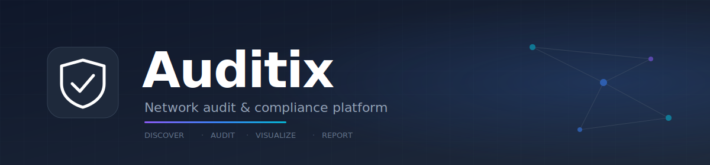
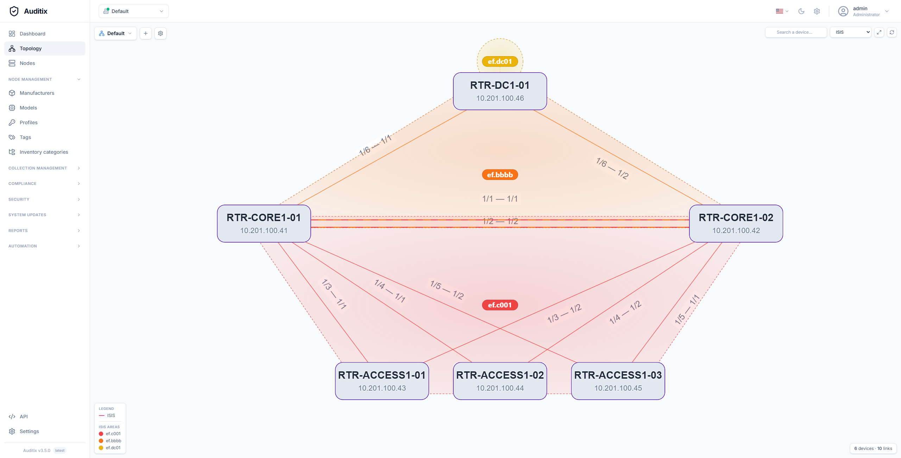
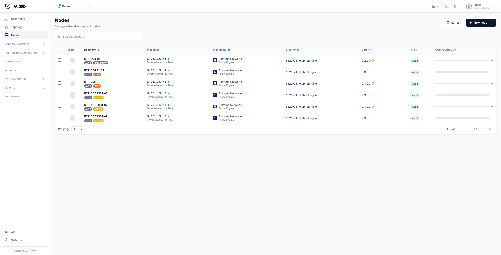

<div align="center">

[](https://github.com/tchevalleraud/auditix)

**Discover · Audit · Visualize · Report**
*Open-source network audit & compliance platform for modern infrastructure teams.*

[](https://github.com/tchevalleraud/auditix/releases/latest) [](LICENSE) [](#) [](#quick-start)

[📖 **Documentation**](https://tchevalleraud.github.io/auditix/) · [💡 **Request a feature**](https://auditix.featurebase.app/)

</div>

---

## What you get

<div align="center">

### Live dashboard at a glance
*Compliance scoring, fleet health, and recent activity in one place.*


### Auto-discovered topology
*LLDP, STP, OSPF, BGP and ISIS links, drawn from your collected configurations.*



### Unified node inventory
*Every device, its profile, score, tags and last collection — searchable and sortable.*



</div>

---

## Why Auditix?

- 🔍 **Discover everything** — automatic SSH-based configuration collection across your entire fleet, no agent required.
- 🛡️ **Audit with confidence** — flexible compliance rules with regex extraction, condition trees and severity-weighted **A–F grading**.
- 🗺️ **See the whole network** — topology maps auto-built from LLDP/STP/OSPF/BGP/ISIS, with manual link overrides and area coloring.
- 📄 **Ship pretty PDF reports** — drag-and-drop block editor with compliance matrices, recommendations, CLI excerpts and themed cover pages.
- ⚡ **Stays in sync, live** — Mercure-powered real-time progress for collections, evaluations and pings, with horizontally scalable async workers.
- 🔐 **Multi-tenant by design** — context isolation, TOTP 2FA, fine-grained credentials, dark mode and a UI in **6 languages**.

---

## Highlights

<table>
<tr>
<td width="50%" valign="top">

### 📦 Fleet management
- Nodes with manufacturer / model / profile metadata
- Color-coded tags
- Multi-tenant **contexts** for full data isolation
- CSV import, ZIP import for offline collections
- TOTP two-factor authentication

### 🔌 Configuration collection
- SSH via `phpseclib3`, model-specific connection scripts
- Tree-organized commands and folders
- Regex-based extraction → inventory mapping
- File-based storage, scalable async workers
- Real-time progress over SSE

### 🛡️ Compliance
- Policies grouping rules and target nodes
- Multi-source rules: inventory, collection files, live SSH
- `match` / `count` / `capture` regex modes
- Condition trees (AND / OR, operators)
- Severity-weighted **A–F** scoring with error penalty
- Folder-organized rule libraries

</td>
<td width="50%" valign="top">

### 🗺️ Topology
- LLDP / STP / OSPF / BGP / ISIS auto-discovery
- Manual link editing & context menu
- Multi-area ISIS coloring with draggable labels
- Compliance & monitoring overlays
- Custom viewport framing for reports

### 📄 Reports
- Drag-and-drop block editor with **13 block types**
- Inventory tables, CLI excerpts, equipment lists, action plans
- **Compliance matrix**, **non-compliant devices**, **status by device**
- **Rule recommendation** block (static or live-evaluated, text or CLI)
- Themed PDF generation, cover pages, TOC, revisions

### 🔧 Operations
- ICMP ping with live status
- Unified task board (collections + tasks)
- Public **REST API v1** with Swagger UI & token auth
- Scheduler, cleanup and health-check workers
- 6-language UI · built-in dark mode

</td>
</tr>
</table>

---

## Quick start

```bash
git clone https://github.com/tchevalleraud/auditix.git
cd auditix
cp .env.example .env
make up
```

Open <http://localhost> and sign in with `admin` / `password`.

> 💡 For remote / production deployment, set `APP_ENV=prod` and `DEFAULT_URI=http://<your-host>:<port>` in `.env` before `make up`.

### Useful commands

```bash
make up        # Start everything (build + install on first launch)
make down      # Stop all services
make restart   # Restart all services
make logs      # Tail logs
make upgrade   # Pull latest, rebuild, migrate, restart workers
```

---

## License

Auditix is open-source under the [MIT License](LICENSE).
