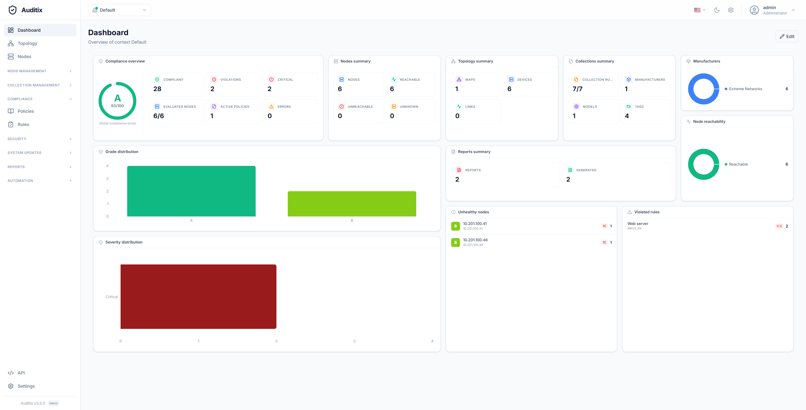

# Dashboard

The dashboard is the first page you see after logging in. It provides an overview of your current context.

<!--  -->

From the dashboard you can quickly see:

- **Total nodes** registered in the context
- **Compliance scores** across your infrastructure
- **Recent collections** and their status
- **Monitoring alerts** (if monitoring is enabled)

## Context Switcher

Use the context switcher in the top-left of the navigation bar to switch between your different contexts. Each context has its own isolated set of nodes, policies, reports, and settings.

<!--  -->
